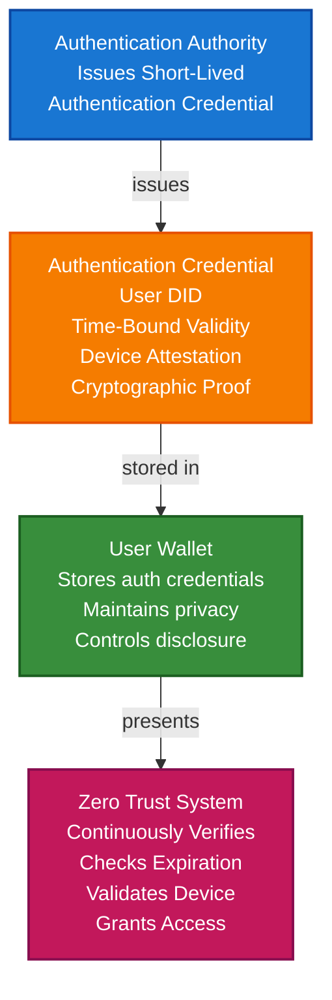

# Zero Trust Continuous Authentication Scenario

This guide demonstrates how to build a Zero Trust continuous authentication system using TrustWeave. You'll learn how authentication authorities can issue short-lived authentication credentials, how users can store them in wallets, and how systems can continuously verify authentication without traditional session-based access.

## What You'll Build

By the end of this tutorial, you'll have:

- ✅ Created DIDs for authentication authority (issuer) and users (holder)
- ✅ Issued Verifiable Credentials for short-lived authentication
- ✅ Stored authentication credentials in wallet
- ✅ Implemented continuous re-authentication
- ✅ Created time-bound authentication credentials
- ✅ Verified authentication without session cookies
- ✅ Implemented device attestation integration
- ✅ Demonstrated Zero Trust principles

## Big Picture & Significance

### The Zero Trust Challenge

Traditional authentication relies on session-based access that becomes vulnerable once a session is established. Zero Trust requires continuous verification of identity, device, and context. Verifiable credentials enable continuous authentication without traditional sessions.

**Industry Context:**
- **Market Adoption**: 60% of enterprises adopting Zero Trust by 2025
- **Security**: Eliminates "trust but verify" model
- **Regulatory**: NIST 800-207 Zero Trust Architecture
- **User Experience**: Seamless authentication without constant password entry
- **Threat Landscape**: Growing need for continuous verification

**Why This Matters:**
1. **Security**: Continuous verification prevents session hijacking
2. **Compliance**: Meet Zero Trust architecture requirements
3. **User Experience**: Seamless authentication experience
4. **Device Trust**: Verify device identity continuously
5. **Context Awareness**: Verify user context (location, time, behavior)
6. **No Sessions**: Eliminate vulnerable session-based access

### The Zero Trust Problem

Traditional authentication faces critical issues:
- **Session Vulnerability**: Once authenticated, sessions are vulnerable
- **No Continuous Verification**: Trust is granted once, not continuously
- **Device Blindness**: No verification of device identity
- **Context Ignorance**: No awareness of user context
- **Password Fatigue**: Constant password entry frustrates users
- **Compliance Risk**: May not meet Zero Trust requirements

## Value Proposition

### Problems Solved

1. **Continuous Verification**: Verify identity continuously, not just once
2. **No Sessions**: Eliminate vulnerable session-based access
3. **Device Trust**: Verify device identity continuously
4. **Context Awareness**: Verify user context (location, time, behavior)
5. **Seamless UX**: Fast authentication without password fatigue
6. **Compliance**: Automated compliance with Zero Trust architecture
7. **Fraud Prevention**: Cryptographic proof prevents authentication fraud

### Business Benefits

**For System Administrators:**
- **Security**: Continuous verification prevents attacks
- **Compliance**: Automated Zero Trust architecture compliance
- **Trust**: Cryptographic proof of authentication
- **Efficiency**: Streamlined authentication process
- **User Experience**: Improved user satisfaction

**For Users:**
- **Convenience**: Fast, seamless authentication
- **Security**: Continuous protection
- **Privacy**: Control authentication data
- **Portability**: Authentication credentials work everywhere
- **Control**: Own and control authentication credentials

**For Authentication Authorities:**
- **Efficiency**: Automated credential issuance
- **Compliance**: Meet Zero Trust requirements
- **Trust**: Enhanced trust through verifiable credentials
- **Scalability**: Handle more authentications

### ROI Considerations

- **Security**: Eliminates session-based attacks
- **Compliance**: Automated Zero Trust compliance
- **User Experience**: 10x faster authentication
- **Cost Reduction**: 80-90% reduction in password reset costs
- **Fraud Prevention**: Eliminates authentication fraud

## Understanding the Problem

Traditional authentication has several problems:

1. **Session vulnerability**: Once authenticated, sessions are vulnerable
2. **No continuous verification**: Trust is granted once, not continuously
3. **Device blindness**: No verification of device identity
4. **Context ignorance**: No awareness of user context
5. **Password fatigue**: Constant password entry frustrates users

TrustWeave solves this by enabling:

- **Continuous verification**: Verify identity continuously
- **No sessions**: Eliminate session-based access
- **Device trust**: Verify device identity continuously
- **Context awareness**: Verify user context
- **Seamless UX**: Fast authentication without passwords

## How It Works: The Zero Trust Authentication Flow



## Prerequisites

- Java 21+
- Kotlin 2.2.21+
- Gradle 8.5+
- Basic understanding of Kotlin and coroutines

## Step 1: Add Dependencies

Add TrustWeave dependencies to your `build.gradle.kts`:

```kotlin
dependencies {
    // Core TrustWeave modules
    implementation("org.trustweave:distribution-all:1.0.0-SNAPSHOT")

    // Kotlinx Serialization
    implementation("org.jetbrains.kotlinx:kotlinx-serialization-json:1.6.0")

    // Coroutines
    implementation("org.jetbrains.kotlinx:kotlinx-coroutines-core:1.7.3")
}
```

## Step 2: Complete Runnable Example

Here's the full Zero Trust continuous authentication flow using the TrustWeave facade API:

```kotlin
package com.example.zero.trust

import org.trustweave.TrustWeave
import org.trustweave.core.*
import org.trustweave.credential.PresentationOptions
import org.trustweave.credential.wallet.Wallet
import org.trustweave.spi.services.WalletCreationOptionsBuilder
import kotlinx.coroutines.runBlocking
import java.time.Instant
import java.time.temporal.ChronoUnit

fun main() = runBlocking {
    println("=".repeat(70))
    println("Zero Trust Continuous Authentication Scenario - Complete End-to-End Example")
    println("=".repeat(70))

    // Step 1: Create TrustWeave instance
    val trustWeave = TrustWeave.build {
        factories(
            kmsFactory = TestkitKmsFactory(),
            didMethodFactory = TestkitDidMethodFactory()
        )
        keys { provider(IN_MEMORY); algorithm(ED25519) }
        did { method(KEY) { algorithm(ED25519) } }
    }
    println("\n✅ TrustWeave initialized")

    // Step 2: Create DIDs for authentication authority, users, and systems
    import org.trustweave.trust.types.getOrThrowDid
    import org.trustweave.trust.types.getOrThrow
    import org.trustweave.did.resolver.DidResolutionResult
    import org.trustweave.did.identifiers.extractKeyId
    
    // Helper extension for resolution results
    fun DidResolutionResult.getOrThrow() = when (this) {
        is DidResolutionResult.Success -> this.document
        else -> throw IllegalStateException("Failed to resolve DID: ${this.errorMessage ?: "Unknown error"}")
    }
    
    val authAuthorityDid = trustWeave.createDid { method(KEY) }.getOrThrowDid()
    val authAuthorityDoc = trustWeave.resolveDid(authAuthorityDid).getOrThrow()
    val authAuthorityKeyId = authAuthorityDoc.verificationMethod.firstOrNull()?.extractKeyId()
        ?: throw IllegalStateException("No verification method found")

    val userDid = trustWeave.createDid { method(KEY) }.getOrThrowDid()
    val deviceDid = trustWeave.createDid { method(KEY) }.getOrThrowDid()
    val systemDid = trustWeave.createDid { method(KEY) }.getOrThrowDid()

    println("✅ Authentication Authority DID: ${authAuthorityDid.value}")
    println("✅ User DID: ${userDid.value}")
    println("✅ Device DID: ${deviceDid.value}")
    println("✅ System DID: ${systemDid.value}")

    // Step 3: Issue short-lived authentication credential (15 minutes)
    import org.trustweave.trust.types.IssuanceResult
import org.trustweave.trust.types.VerificationResult
    
    val authCredentialResult = trustWeave.issue {
        credential {
            type("VerifiableCredential", "AuthenticationCredential", "ZeroTrustCredential")
            issuer(authAuthorityDid)
            subject {
                id(userDid)
                "authentication" {
                    "authenticated" to true
                    "authenticationMethod" to "Multi-Factor"
                    "authenticationDate" to Instant.now().toString()
                    "deviceId" to deviceDid.value
                    "deviceAttested" to true
                    "deviceTrustLevel" to "High"
                    "context" {
                        "location" to "Office Building A"
                        "ipAddress" to "10.0.1.100"
                        "network" to "Corporate LAN"
                        "timeOfDay" to Instant.now().toString()
                    }
                    "riskScore" to 0.1 // Low risk
                    "behavioralAnalysis" to "Normal"
                }
            }
            issued(Instant.now())
            expires(15, ChronoUnit.MINUTES) // Short-lived
        }
        signedBy(authAuthorityDid)
    }
    
    val authCredential = authCredentialResult.getOrThrow()

    println("\n✅ Short-lived authentication credential issued: ${authCredential.id}")
    println("   Validity: 15 minutes")
    println("   Device: ${deviceDid.value}")
    println("   Note: No traditional session created")

    // Step 4: Create user wallet and store authentication credential
    val userWallet = trustWeave.wallet {
        holder(userDid)
        enableOrganization()
        enablePresentation()
    }.getOrThrow()

    val authCredentialId = userWallet.store(authCredential)
    println("✅ Authentication credential stored in wallet: $authCredentialId")

    // Step 5: Organize credential
    userWallet.withOrganization { org ->
        val authCollectionId = org.createCollection("Authentication", "Authentication credentials")
        org.addToCollection(authCredentialId, authCollectionId)
        org.tagCredential(authCredentialId, setOf("authentication", "zero-trust", "short-lived", "device-attested"))
        println("✅ Authentication credential organized")
    }

    // Step 6: Initial authentication verification
    println("\n🔐 Initial Authentication Verification:")

    import org.trustweave.trust.types.VerificationResult
    
    val initialVerification = trustWeave.verify {
        credential(authCredential)
    }

    when (initialVerification) {
        is VerificationResult.Valid -> {
        val credentialSubject = authCredential.credentialSubject
        val authentication = credentialSubject.jsonObject["authentication"]?.jsonObject
        val authenticated = authentication?.get("authenticated")?.jsonPrimitive?.content?.toBoolean() ?: false
        val deviceAttested = authentication?.get("deviceAttested")?.jsonPrimitive?.content?.toBoolean() ?: false
        val riskScore = authentication?.get("riskScore")?.jsonPrimitive?.content?.toDouble() ?: 1.0

        println("✅ Authentication Credential: VALID")
        println("   Authenticated: $authenticated")
        val credentialSubject = authCredential.credentialSubject
        val authentication = credentialSubject.claims["authentication"]?.jsonObject
        val authenticated = authentication?.get("authenticated")?.jsonPrimitive?.content?.toBoolean() ?: false
        val deviceAttested = authentication?.get("deviceAttested")?.jsonPrimitive?.content?.toBoolean() ?: false
        val riskScore = authentication?.get("riskScore")?.jsonPrimitive?.content?.toDouble() ?: 1.0
        
        println("   Device Attested: $deviceAttested")
        println("   Risk Score: $riskScore")

        if (authenticated && deviceAttested && riskScore < 0.5) {
            println("✅ Authentication requirements MET")
            println("✅ Device trust verified")
            println("✅ Risk assessment passed")
            println("✅ Access GRANTED to system")
        } else {
            println("❌ Authentication requirements NOT MET")
            println("❌ Access DENIED")
        }
        }
        is VerificationResult.Invalid -> {
            println("❌ Authentication Credential: INVALID")
            println("❌ Access DENIED")
        }
    }

    // Step 7: Continuous re-authentication (after 5 minutes)
    println("\n🔐 Continuous Re-Authentication (5 minutes later):")

    // Simulate time passing - in production, this would be a real-time check
    val reAuthCredentialResult = trustWeave.issue {
        credential {
            type("VerifiableCredential", "AuthenticationCredential", "ZeroTrustCredential")
            issuer(authAuthorityDid)
            subject {
                id(userDid)
                "authentication" {
                    "authenticated" to true
                    "authenticationMethod" to "Continuous"
                    "authenticationDate" to Instant.now().toString()
                    "deviceId" to deviceDid.value
                    "deviceAttested" to true
                    "deviceTrustLevel" to "High"
                    "context" {
                        "location" to "Office Building A"
                        "ipAddress" to "10.0.1.100"
                        "network" to "Corporate LAN"
                        "timeOfDay" to Instant.now().toString()
                    }
                    "riskScore" to 0.15 // Slightly higher but still low
                    "behavioralAnalysis" to "Normal"
                    "previousAuthTime" to Instant.now().minus(5, ChronoUnit.MINUTES).toString()
                }
            }
            issued(Instant.now())
            expires(15, ChronoUnit.MINUTES)
        }
        signedBy(authAuthorityDid)
    }
    
    val reAuthCredential = reAuthCredentialResult.getOrThrow()

    val reAuthVerification = trustWeave.verify {
        credential(reAuthCredential)
    }

    if (reAuthVerification.valid) {
        println("✅ Re-Authentication Credential: VALID")
        println("   Continuous verification: PASSED")
        val reAuthSubject = reAuthCredential.credentialSubject
        val reAuthAuth = reAuthSubject.claims["authentication"]?.jsonObject
        val reAuthDeviceAttested = reAuthAuth?.get("deviceAttested")?.jsonPrimitive?.content?.toBoolean() ?: false
        val reAuthRiskScore = reAuthAuth?.get("riskScore")?.jsonPrimitive?.content?.toDouble() ?: 1.0
        
        println("   Device still trusted: ${if (reAuthDeviceAttested) "YES" else "NO"}")
        println("   Risk score acceptable: ${if (reAuthRiskScore < 0.5) "YES" else "NO"}")
        println("✅ Access CONTINUED")
        }
        is VerificationResult.Invalid -> {
            println("❌ Re-Authentication Credential: INVALID")
            println("❌ Access REVOKED")
        }
    }

    // Step 8: Expired credential verification
    println("\n🔐 Expired Credential Verification:")

    // Create an expired credential
    val expiredCredentialResult = trustWeave.issue {
        credential {
            type("VerifiableCredential", "AuthenticationCredential", "ZeroTrustCredential")
            issuer(authAuthorityDid)
            subject {
                id(userDid)
                "authentication" {
                    "authenticated" to true
                    "authenticationDate" to Instant.now().minus(20, ChronoUnit.MINUTES).toString()
                }
            }
            issued(Instant.now().minus(20, ChronoUnit.MINUTES))
            expires(Instant.now().minus(5, ChronoUnit.MINUTES)) // Already expired
        }
        signedBy(authAuthorityDid)
    }
    
    val expiredCredential = expiredCredentialResult.getOrThrow()
        else -> throw IllegalStateException("Failed to issue expired credential")
    }

    val expiredVerification = trustWeave.verify {
        credential(expiredCredential)
        checkExpiration()
    }

    when (expiredVerification) {
        is VerificationResult.Valid -> {
            // Should not happen for expired credential
        }
        is VerificationResult.Invalid -> {
        println("❌ Expired Credential: INVALID")
        println("   Credential expired: YES")
        println("   Access DENIED")
        println("   Note: User must re-authenticate")
    }

    // Step 9: High-risk scenario verification
    println("\n🔐 High-Risk Scenario Verification:")

    val highRiskCredentialResult = trustWeave.issue {
        credential {
            type("VerifiableCredential", "AuthenticationCredential", "ZeroTrustCredential")
            issuer(authAuthorityDid)
            subject {
                id(userDid)
                "authentication" {
                    "authenticated" to true
                    "authenticationDate" to Instant.now().toString()
                    "deviceId" to deviceDid.value
                    "deviceAttested" to false // Device not attested
                    "context" {
                        "location" to "Unknown"
                        "ipAddress" to "192.168.1.1"
                        "network" to "Public WiFi"
                    }
                    "riskScore" to 0.85 // High risk
                    "behavioralAnalysis" to "Anomalous"
                }
            }
            issued(Instant.now())
            expires(15, ChronoUnit.MINUTES)
        }
        signedBy(authAuthorityDid)
    }
    
    val highRiskCredential = highRiskCredentialResult.getOrThrow()

    val highRiskVerification = trustWeave.verify {
        credential(highRiskCredential)
    }

    when (highRiskVerification) {
        is VerificationResult.Valid -> {
        val credentialSubject = highRiskCredential.credentialSubject
        val authentication = credentialSubject.jsonObject["authentication"]?.jsonObject
        val deviceAttested = authentication?.get("deviceAttested")?.jsonPrimitive?.content?.toBoolean() ?: false
        val riskScore = authentication?.get("riskScore")?.jsonPrimitive?.content?.toDouble() ?: 1.0

        println("✅ Authentication Credential: VALID (structurally)")
        println("   Device Attested: $deviceAttested")
        println("   Risk Score: $riskScore")

        if (!deviceAttested || riskScore > 0.5) {
            println("❌ Security requirements NOT MET")
            println("❌ Device not trusted or risk too high")
            println("❌ Access DENIED - Additional verification required")
        }
    }

    // Step 10: Create privacy-preserving authentication presentation
    val authPresentation = userWallet.withPresentation { pres ->
        pres.createPresentation(
            credentialIds = listOf(authCredentialId),
            holderDid = userDid.value,
            options = PresentationOptions(
                holderDid = userDid.value,
                challenge = "zero-trust-auth-${System.currentTimeMillis()}"
            )
        )
    } ?: error("Presentation capability not available")

    println("\n✅ Privacy-preserving authentication presentation created")
    println("   Holder: ${authPresentation.holder}")
    println("   Credentials: ${authPresentation.verifiableCredential.size}")
    println("   Note: Only authentication status shared, no personal details")

    // Step 11: Demonstrate privacy - verify no personal information is exposed
    println("\n🔒 Privacy Verification:")
    val presentationCredential = authPresentation.verifiableCredential.firstOrNull()
    if (presentationCredential != null) {
        val subject = presentationCredential.credentialSubject
        val hasFullName = subject.jsonObject.containsKey("fullName")
        val hasEmail = subject.jsonObject.containsKey("email")
        val hasPassword = subject.jsonObject.containsKey("password")
        val hasAuthentication = subject.jsonObject.containsKey("authentication")

        println("   Full Name exposed: $hasFullName ❌")
        println("   Email exposed: $hasEmail ❌")
        println("   Password exposed: $hasPassword ❌")
        println("   Authentication status: $hasAuthentication ✅")
        println("✅ Privacy preserved - only authentication status shared")
    }

    // Step 12: Display wallet statistics
    val stats = userWallet.getStatistics()
    println("\n📊 User Wallet Statistics:")
    println("   Total credentials: ${stats.totalCredentials}")
    println("   Valid credentials: ${stats.validCredentials}")
    println("   Collections: ${stats.collectionsCount}")
    println("   Tags: ${stats.tagsCount}")

    // Step 13: Summary
    println("\n" + "=".repeat(70))
    println("✅ ZERO TRUST CONTINUOUS AUTHENTICATION SYSTEM COMPLETE")
    println("   Short-lived authentication credentials issued")
    println("   Continuous re-authentication implemented")
    println("   Device attestation integrated")
    println("   Risk-based access control enabled")
    println("   No traditional sessions used")
    println("=".repeat(70))
}
```

**Expected Output:**
```
======================================================================
Zero Trust Continuous Authentication Scenario - Complete End-to-End Example
======================================================================

✅ TrustWeave initialized
✅ Authentication Authority DID: did:key:z6Mk...
✅ User DID: did:key:z6Mk...
✅ Device DID: did:key:z6Mk...
✅ System DID: did:key:z6Mk...

✅ Short-lived authentication credential issued: urn:uuid:...
   Validity: 15 minutes
   Device: did:key:z6Mk...
   Note: No traditional session created
✅ Authentication credential stored in wallet: urn:uuid:...
✅ Authentication credential organized

🔐 Initial Authentication Verification:
✅ Authentication Credential: VALID
   Authenticated: true
   Device Attested: true
   Risk Score: 0.1
✅ Authentication requirements MET
✅ Device trust verified
✅ Risk assessment passed
✅ Access GRANTED to system

🔐 Continuous Re-Authentication (5 minutes later):
✅ Re-Authentication Credential: VALID
   Continuous verification: PASSED
   Device still trusted: YES
   Risk score acceptable: YES
✅ Access CONTINUED

🔐 Expired Credential Verification:
❌ Expired Credential: INVALID
   Credential expired: YES
   Access DENIED
   Note: User must re-authenticate

🔐 High-Risk Scenario Verification:
✅ Authentication Credential: VALID (structurally)
   Device Attested: false
   Risk Score: 0.85
❌ Security requirements NOT MET
❌ Device not trusted or risk too high
❌ Access DENIED - Additional verification required

✅ Privacy-preserving authentication presentation created
   Holder: did:key:z6Mk...
   Credentials: 1

🔒 Privacy Verification:
   Full Name exposed: false ❌
   Email exposed: false ❌
   Password exposed: false ❌
   Authentication status: true ✅
✅ Privacy preserved - only authentication status shared

📊 User Wallet Statistics:
   Total credentials: 1
   Valid credentials: 1
   Collections: 1
   Tags: 4

======================================================================
✅ ZERO TRUST CONTINUOUS AUTHENTICATION SYSTEM COMPLETE
   Short-lived authentication credentials issued
   Continuous re-authentication implemented
   Device attestation integrated
   Risk-based access control enabled
   No traditional sessions used
======================================================================
```

## Key Features Demonstrated

1. **Short-Lived Credentials**: 15-minute validity for continuous verification
2. **No Sessions**: Eliminate traditional session-based access
3. **Device Attestation**: Verify device identity continuously
4. **Risk-Based Access**: Risk scoring for access decisions
5. **Continuous Re-Auth**: Re-authenticate periodically
6. **Context Awareness**: Verify user context (location, network, time)

## Real-World Extensions

- **Behavioral Biometrics**: Integrate behavioral analysis
- **Adaptive Validity**: Adjust credential validity based on risk
- **Multi-Device Support**: Support authentication across multiple devices
- **Location-Based Policies**: Enforce location-based access policies
- **Time-Based Policies**: Enforce time-of-day access policies
- **Revocation**: Revoke compromised authentication credentials
- **Blockchain Anchoring**: Anchor authentication events for audit trails

## Related Documentation

- [Quick Start](../getting-started/quick-start.md) - Get started with TrustWeave
- [Security Clearance Scenario](security-clearance-access-control-scenario.md) - Related access control scenario
- [IoT Device Identity Scenario](iot-device-identity-scenario.md) - Device attestation integration
- [Common Patterns](../getting-started/common-patterns.md) - Reusable code patterns
- [API Reference](../api-reference/core-api.md) - Complete API documentation
- [Troubleshooting](../getting-started/troubleshooting.md) - Common issues and solutions


