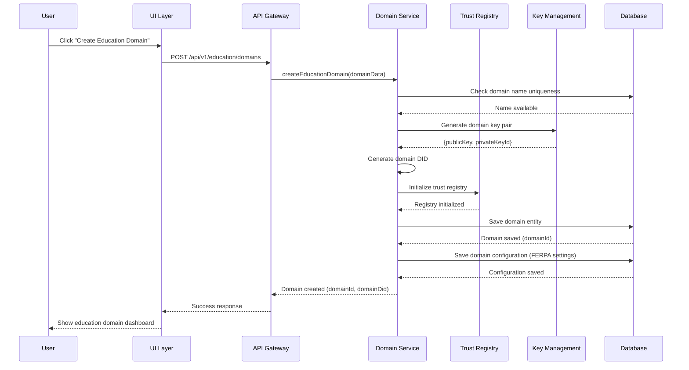
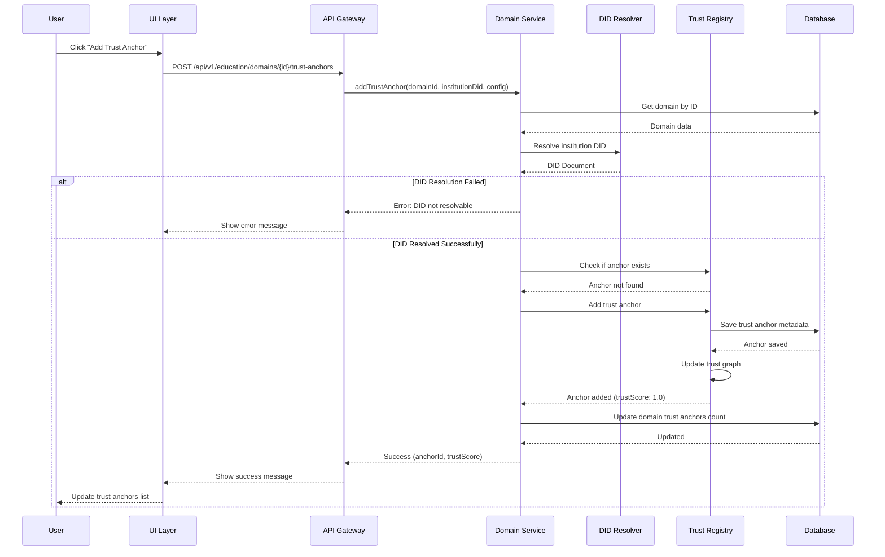
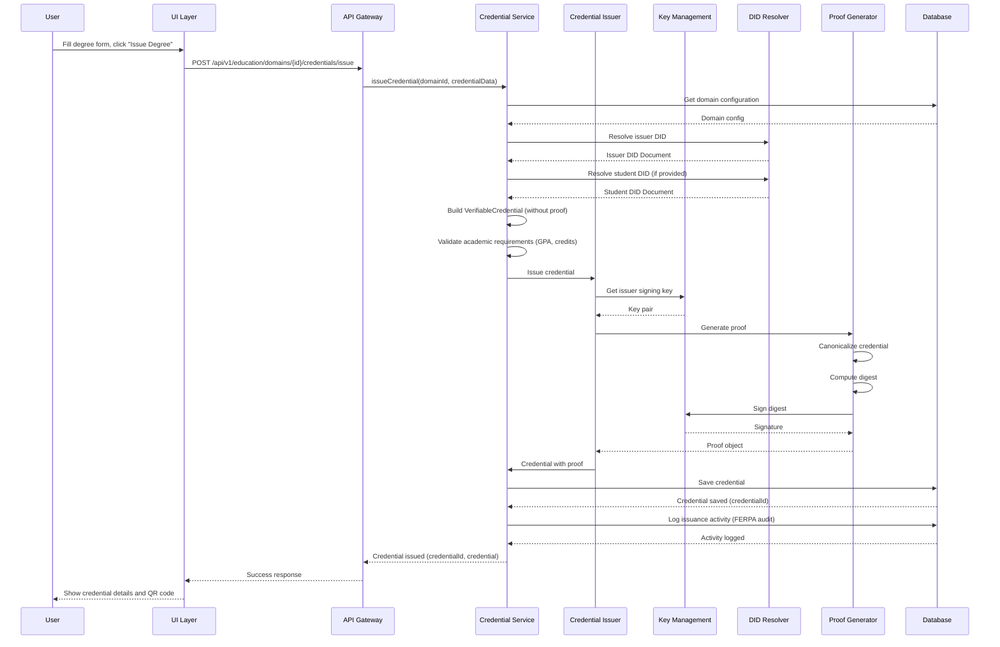
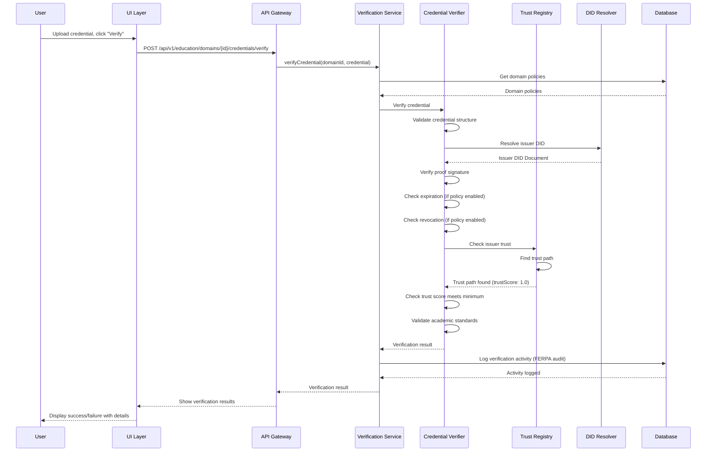
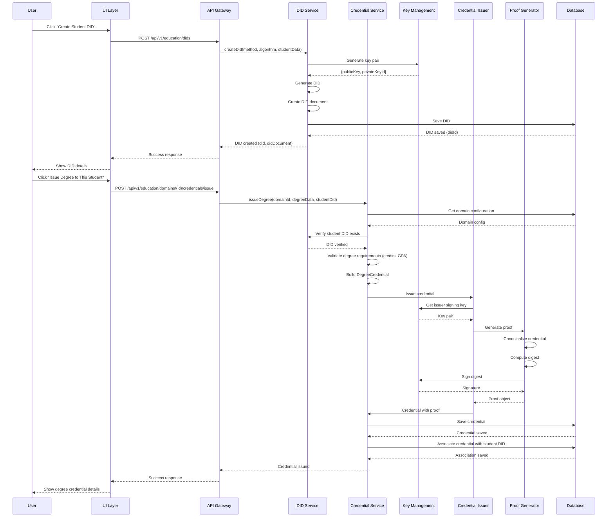
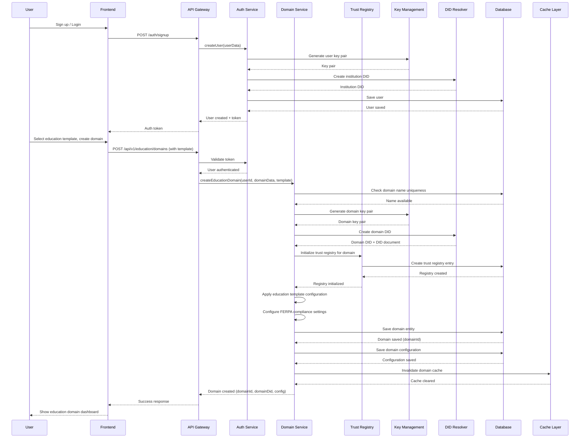

# Guide UX du Domaine Éducation - Documentation d'Expérience Utilisateur pour les Cas d'Usage Éducatifs

## Table des Matières

1. [Vue d'ensemble](#vue-densemble)
2. [Parcours Utilisateur : Création d'un Domaine de Confiance Éducation](#parcours-utilisateur--création-dun-domaine-de-confiance-éducation)
3. [Diagrammes de Séquence Backend](#diagrammes-de-séquence-backend)
4. [Scénario : Création d'un DID Étudiant et Émission de Justificatifs Académiques](#scénario--création-dun-did-étudiant-et-émission-de-justificatifs-académiques)
5. [Scénario : Mise à Jour d'un Justificatif Académique](#scénario--mise-à-jour-dun-justificatif-académique)
6. [Scénario : Révocation d'un Justificatif Académique](#scénario--révocation-dun-justificatif-académique)
7. [Scénario : Gestion du Portefeuille Étudiant](#scénario--gestion-du-portefeuille-étudiant)
8. [Scénario : Présentations Vérifiables et Divulgation Sélective](#scénario--présentations-vérifiables-et-divulgation-sélective)
9. [Scénario : Ancrage Blockchain pour les Dossiers Académiques](#scénario--ancrage-blockchain-pour-les-dossiers-académiques)
10. [Scénario : Contrats Intelligents Académiques](#scénario--contrats-intelligents-académiques)
11. [Gestion des Erreurs et Cas Limites](#gestion-des-erreurs-et-cas-limites)
12. [Considérations UX Mobile](#considérations-ux-mobile)

---

## Vue d'ensemble

Ce document fournit un guide complet de l'expérience utilisateur pour créer, configurer et utiliser les Domaines de Confiance dans TrustWeave spécifiquement pour les institutions éducatives. Il inclut des flux d'écrans détaillés, des diagrammes de séquence backend, et des scénarios pour les opérations éducatives courantes telles que l'émission de diplômes, relevés de notes, certificats, et la gestion des justificatifs étudiants.

### Concepts Clés

- **Domaine de Confiance Éducation** : Un conteneur pour les ancres de confiance éducatives (universités, écoles, organismes de certification), types de justificatifs (diplômes, relevés de notes, certificats), et politiques qui définissent qui peut émettre quels justificatifs académiques
- **Ancre de Confiance** : Un DID d'institution éducative qui est approuvé dans un domaine pour émettre des types de justificatifs spécifiques (par exemple, une université autorisée à émettre des justificatifs de diplôme)
- **Chemin de Confiance** : Une chaîne de relations de confiance reliant un vérificateur (employeur, école supérieure) à un émetteur (université, organisme de certification)
- **Score de Confiance** : Une valeur numérique (0.0-1.0) indiquant la force de la relation de confiance entre institutions

### Cas d'Usage Spécifiques à l'Éducation

- **Justificatifs Académiques** : Diplômes, certificats et relevés de notes
- **Formation Continue** : Certificats de développement professionnel et crédits de formation continue
- **Justificatifs de Compétences** : Micro-justificatifs, badges et certifications de compétences
- **Crédits de Transfert** : Crédits de cours vérifiés pour transfert entre institutions
- **Vérification Étudiante** : Vérification d'identité pour les étudiants postulant à des programmes ou employeurs
- **Accréditation Institutionnelle** : Justificatifs d'accréditation pour les institutions éducatives

---

## Parcours Utilisateur : Création d'un Domaine de Confiance Éducation

### Phase 1 : Intégration et Création de Domaine

#### Étape 1 : Bienvenue et Inscription

**Écran : Page de Bienvenue**

```
┌─────────────────────────────────────────────────────────┐
│  TrustWeave Education - Justificatifs Académiques Vérifiables │
│                                                           │
│  Émettre, vérifier et gérer les justificatifs académiques│
│  avec une confiance ancrée sur la blockchain             │
│                                                           │
│  [Commencer]  [En Savoir Plus]  [Voir la Documentation]  │
└─────────────────────────────────────────────────────────┘
```

**Action Utilisateur :** Clique sur "Commencer"

**Réponse Système :** Redirige vers la page d'inscription

---

#### Étape 2 : Création de Compte

**Écran : Formulaire d'Inscription**

```
┌─────────────────────────────────────────────────────────┐
│  Créez Votre Compte TrustWeave Education                │
│                                                           │
│  Email :                                                  │
│  ┌─────────────────────────────────────────────────────┐ │
│  │ registrar@stateuniversity.edu                        │ │
│  └─────────────────────────────────────────────────────┘ │
│                                                           │
│  Mot de passe :                                           │
│  ┌─────────────────────────────────────────────────────┐ │
│  │ ••••••••••                                          │ │
│  └─────────────────────────────────────────────────────┘ │
│                                                           │
│  Nom de l'institution :                                   │
│  ┌─────────────────────────────────────────────────────┐ │
│  │ State University                                     │ │
│  └─────────────────────────────────────────────────────┘ │
│                                                           │
│  Type d'institution :                                     │
│  ┌─────────────────────────────────────────────────────┐ │
│  │ Université/Collège                                   │ │
│  └─────────────────────────────────────────────────────┘ │
│                                                           │
│  ☐ J'accepte les Conditions d'Utilisation et la Politique de Confidentialité │
│                                                           │
│  [Créer un Compte]                                        │
│                                                           │
│  Vous avez déjà un compte ? [Se Connecter]               │
└─────────────────────────────────────────────────────────┘
```

**Événements Backend :**
1. Valider le format de l'email
2. Vérifier la force du mot de passe
3. Vérifier si l'email existe déjà
4. Créer le compte utilisateur
5. Générer le DID de l'institution
6. Créer la paire de clés par défaut
7. Initialiser la session utilisateur

---

#### Étape 3 : Assistant de Configuration Initiale

**Écran : "Configurons Votre Domaine de Confiance Éducation"**

```
┌─────────────────────────────────────────────────────────┐
│  Étape 1 sur 3 : À quoi utiliserez-vous TrustWeave Education ?│
│                                                           │
│  Sélectionnez un modèle pour commencer rapidement :      │
│                                                           │
│  ┌─────────────────────────────────────────────────────┐ │
│  │ 🎓 Gestion des Diplômes et Relevés de Notes         │ │
│  │    Émettre des diplômes, relevés de notes et dossiers académiques │
│  │    [Sélectionner]                                    │ │
│  └─────────────────────────────────────────────────────┘ │
│                                                           │
│  ┌─────────────────────────────────────────────────────┐ │
│  │ 📜 Formation Continue et Certificats                │ │
│  │    Développement professionnel et programmes de certification│ │
│  │    [Sélectionner]                                    │ │
│  └─────────────────────────────────────────────────────┘ │
│                                                           │
│  ┌─────────────────────────────────────────────────────┐ │
│  │ 🏅 Compétences et Micro-Justificatifs                │ │
│  │    Émettre des badges et justificatifs basés sur les compétences │
│  │    [Sélectionner]                                    │ │
│  └─────────────────────────────────────────────────────┘ │
│                                                           │
│  ┌─────────────────────────────────────────────────────┐ │
│  │ 🔗 Vérification des Crédits de Transfert            │ │
│  │    Vérifier et transférer des crédits entre institutions │
│  │    [Sélectionner]                                    │ │
│  └─────────────────────────────────────────────────────┘ │
│                                                           │
│  ┌─────────────────────────────────────────────────────┐ │
│  │ 🏛️ Accréditation Institutionnelle                   │ │
│  │    Gérer les justificatifs d'accréditation pour les institutions │
│  │    [Sélectionner]                                    │ │
│  └─────────────────────────────────────────────────────┘ │
│                                                           │
│  ┌─────────────────────────────────────────────────────┐ │
│  │ ⚙️ Cas d'Usage Éducation Personnalisé               │ │
│  │    Commencer à partir de zéro avec un domaine vide  │ │
│  │    [Sélectionner]                                    │ │
│  └─────────────────────────────────────────────────────┘ │
│                                                           │
│  [Passer pour l'instant]                                  │
└─────────────────────────────────────────────────────────┘
```

**Action Utilisateur :** Sélectionne "Gestion des Diplômes et Relevés de Notes"

**Réponse Système :** 
- Charge la configuration du modèle Gestion des Diplômes et Relevés de Notes
- Pré-remplit les types de justificatifs (DegreeCredential, TranscriptCredential, DiplomaCredential)
- Affiche l'aperçu du modèle

---

#### Étape 4 : Création de Domaine

**Écran : "Créez Votre Domaine de Confiance Éducation"**

```
┌─────────────────────────────────────────────────────────┐
│  Étape 2 sur 3 : Créez Votre Domaine de Confiance Éducation │
│                                                           │
│  Basé sur votre sélection, nous configurerons un domaine │
│  de Gestion des Diplômes et Relevés de Notes avec des    │
│  paramètres par défaut intelligents.                     │
│                                                           │
│  Nom du Domaine : *                                       │
│  ┌─────────────────────────────────────────────────────┐ │
│  │ Dossiers Académiques de State University             │ │
│  └─────────────────────────────────────────────────────┘ │
│  💡 Ce nom sera visible à tous les membres du domaine     │
│                                                           │
│  Description (optionnelle) :                               │
│  ┌─────────────────────────────────────────────────────┐ │
│  │ Émettre et gérer les justificatifs académiques      │
│  │ incluant diplômes, relevés de notes et certifications │
│  │ académiques                                          │
│  └─────────────────────────────────────────────────────┘ │
│                                                           │
│  Visibilité du Domaine :                                  │
│  ○ Privé (seulement vous pouvez voir)                     │
│  ● Organisation (tous les membres de l'org peuvent voir) │
│  ○ Public (n'importe qui peut découvrir)                  │
│                                                           │
│  Paramètres Pré-configurés :                              │
│  ✓ Types de Justificatifs : DegreeCredential,             │
│    TranscriptCredential, DiplomaCredential                │
│  ✓ Politiques par Défaut : Vérifications d'expiration,   │
│    Vérifications de révocation activées                   │
│  ✓ Normes Académiques : Conformité FERPA,                 │
│    Protection de la confidentialité étudiante             │
│                                                           │
│  [← Retour]  [Créer le Domaine]                            │
└─────────────────────────────────────────────────────────┘
```

**Action Utilisateur :** Saisit "Dossiers Académiques de State University", clique sur "Créer le Domaine"

**Événements Backend :**
1. Valider le nom du domaine (unicité dans l'organisation)
2. Créer l'entité domaine dans la base de données
3. Générer le DID du domaine
4. Créer la paire de clés du domaine
5. Initialiser le registre de confiance pour le domaine
6. Appliquer la configuration du modèle
7. Créer les politiques par défaut (incluant les paramètres de conformité FERPA)
8. Retourner l'ID du domaine et le DID

---

### Phase 2 : Configuration des Ancres de Confiance

#### Étape 5 : Ajouter des Ancres de Confiance

**Écran : "Ajouter des Ancres de Confiance Éducatives"**

```
┌─────────────────────────────────────────────────────────┐
│  Ajouter des Ancres de Confiance Éducatives à Votre Domaine │
│                                                           │
│  Les ancres de confiance sont des institutions éducatives│
│  que vous approuvez pour émettre des justificatifs.      │
│  Vous pouvez les ajouter maintenant ou plus tard.        │
│                                                           │
│  Rechercher des institutions :                            │
│  ┌─────────────────────────────────────────────────────┐ │
│  │ 🔍 Rechercher par nom, DID ou domaine...            │ │
│  └─────────────────────────────────────────────────────┘ │
│                                                           │
│  Suggéré pour les Dossiers Académiques :                 │
│                                                           │
│  ┌─────────────────────────────────────────────────────┐ │
│  │ 🎓 Conseil Régional d'Accréditation                 │ │
│  │    did:key:z6MkhaXgBZDvotDkL5257faiztiGiC2QtKLGp... │ │
│  │    Émet : AccreditationCredential                   │ │
│  │    Score de Confiance : N/A (pas encore ajouté)    │ │
│  │    [Ajouter au Domaine]                             │ │
│  └─────────────────────────────────────────────────────┘ │
│                                                           │
│  ┌─────────────────────────────────────────────────────┐ │
│  │ 🏛️ Centre National de Vérification des Étudiants   │ │
│  │    did:key:z6MkhaXgBZDvotDkL5257faiztiGiC2QtKLGp... │ │
│  │    Émet : TranscriptVerificationCredential          │ │
│  │    Score de Confiance : N/A (pas encore ajouté)    │ │
│  │    [Ajouter au Domaine]                             │ │
│  └─────────────────────────────────────────────────────┘ │
│                                                           │
│  ┌─────────────────────────────────────────────────────┐ │
│  │ 🎓 Universités Partenaires                          │ │
│  │    Pour la vérification des crédits de transfert   │ │
│  │    [Parcourir le Réseau Partenaire]                 │ │
│  └─────────────────────────────────────────────────────┘ │
│                                                           │
│  Ou ajouter manuellement :                                │
│  [Ajouter une Institution Personnalisée]  [Importer depuis un Fichier] │
│                                                           │
│  Ancres de Confiance Actuelles (0) :                     │
│  Aucune ancre de confiance ajoutée pour l'instant       │
│                                                           │
│  [← Retour]  [Continuer avec 0 ancres]  [Passer pour l'instant] │
└─────────────────────────────────────────────────────────┘
```

**Action Utilisateur :** Clique sur "Ajouter au Domaine" pour le Conseil Régional d'Accréditation

**Événements Backend :**
1. Résoudre le DID de l'institution
2. Récupérer le document DID de l'institution
3. Valider la résolution du DID
4. Vérifier si l'institution existe déjà dans le domaine
5. Ajouter l'ancre de confiance au registre de confiance du domaine
6. Configurer les restrictions de type de justificatif
7. Mettre à jour le graphe de confiance du domaine
8. Retourner la confirmation de succès

---

#### Étape 6 : Configurer les Détails de l'Ancre de Confiance

**Écran : "Configurer l'Ancre de Confiance"**

```
┌─────────────────────────────────────────────────────────┐
│  Configurer l'Ancre de Confiance : Conseil Régional d'Accréditation │
│                                                           │
│  Informations sur l'Institution :                         │
│  ┌─────────────────────────────────────────────────────┐ │
│  │ DID : did:key:z6MkhaXgBZDvotDkL5257faiztiGiC2QtKLGp│ │
│  │ Nom d'Affichage : Conseil Régional d'Accréditation  │ │
│  │ Statut : ✓ DID Résolu                                │ │
│  └─────────────────────────────────────────────────────┘ │
│                                                           │
│  Types de Justificatifs (sélectionner tous ceux qui s'appliquent) : │
│  ☑ AccreditationCredential                              │
│  ☑ InstitutionVerificationCredential                     │
│  ☐ DegreeCredential                                     │
│  ☐ TranscriptCredential                                 │
│                                                           │
│  Niveau de Confiance :                                    │
│  ┌─────────────────────────────────────────────────────┐ │
│  │ ●─────○─────○─────○─────○                          │ │
│  │ 1.0   0.8  0.6  0.4  0.2  0.0                      │ │
│  │ Confiance Directe (1.0)                            │ │
│  └─────────────────────────────────────────────────────┘ │
│                                                           │
│  Description :                                            │
│  ┌─────────────────────────────────────────────────────┐ │
│  │ Organisme d'accréditation régional pour les institutions éducatives│ │
│  └─────────────────────────────────────────────────────┘ │
│                                                           │
│  Contraintes :                                            │
│  ☑ Exiger l'ancrage blockchain                          │
│  ☑ Exiger une date d'expiration                          │
│  ☑ Exiger une liste de révocation                        │
│                                                           │
│  [Annuler]  [Enregistrer l'Ancre de Confiance]          │
└─────────────────────────────────────────────────────────┘
```

**Action Utilisateur :** Configure les types de justificatifs, clique sur "Enregistrer l'Ancre de Confiance"

**Événements Backend :**
1. Valider les sélections de types de justificatifs
2. Mettre à jour les métadonnées de l'ancre de confiance
3. Enregistrer dans le registre de confiance
4. Mettre à jour la visualisation du graphe de confiance
5. Retourner les informations mises à jour de l'ancre de confiance

---

### Phase 3 : Configuration du Domaine

#### Étape 7 : Configurer les Politiques

**Écran : "Politiques du Domaine Éducation"**

```
┌─────────────────────────────────────────────────────────┐
│  Configurer les Politiques du Domaine Éducation         │
│                                                           │
│  Paramètres de Vérification :                            │
│  ☑ Vérifier l'expiration des justificatifs              │
│  ☑ Vérifier la révocation des justificatifs              │
│  ☑ Vérifier la résolution du DID de l'émetteur          │
│  ☑ Exiger l'ancrage blockchain                           │
│  ☑ Exiger la validation du schéma                        │
│                                                           │
│  Exigences de Confiance :                                 │
│  Score de confiance minimum :                             │
│  ┌─────────────────────────────────────────────────────┐ │
│  │ ●─────○─────○─────○─────○                          │ │
│  │ 0.0   0.2  0.4  0.6  0.8  1.0                      │ │
│  │ (0.8 sélectionné)                                    │ │
│  └─────────────────────────────────────────────────────┘ │
│  💡 Les justificatifs académiques nécessitent des scores │
│     de confiance élevés                                  │
│                                                           │
│  Autoriser la confiance indirecte (chemins de confiance) : │
│  ○ Oui, autoriser les chemins de confiance (recommandé) │
│  ● Non, seulement la confiance directe                   │
│                                                           │
│  Expiration des Justificatifs :                           │
│  ☑ Rejeter les justificatifs expirés                    │
│  ☐ Autoriser les justificatifs expirés avec avertissement│
│  ☐ Autoriser les justificatifs expirés                  │
│                                                           │
│  Politique de Révocation :                                │
│  ● Rejeter les justificatifs révoqués (strict)          │
│  ○ Rejeter les justificatifs révoqués avec avertissement (par défaut) │
│  ○ Autoriser les justificatifs révoqués                  │
│                                                           │
│  Conformité FERPA :                                       │
│  ☑ Activer les protections de confidentialité FERPA     │
│  ☑ Exiger le consentement étudiant pour la divulgation  │
│  ☑ Auditer tous les accès aux justificatifs             │
│                                                           │
│  Normes Académiques :                                     │
│  ☑ Appliquer les exigences du programme de diplôme      │
│  ☑ Vérifier les calculs de GPA                          │
│  ☑ Valider les heures de crédit de cours                │
│                                                           │
│  [← Retour]  [Enregistrer les Politiques]  [Utiliser les Défauts] │
└─────────────────────────────────────────────────────────┘
```

**Action Utilisateur :** Configure les politiques, clique sur "Enregistrer les Politiques"

**Événements Backend :**
1. Valider les paramètres de politique
2. Enregistrer les politiques dans la configuration du domaine
3. Mettre à jour les paramètres du registre de confiance
4. Appliquer les politiques au moteur de vérification
5. Configurer les vérifications de conformité FERPA
6. Retourner la confirmation

---

### Phase 4 : Tableau de Bord du Domaine

#### Étape 8 : Tableau de Bord du Domaine Éducation

**Écran : "Tableau de Bord des Dossiers Académiques de State University"**

```
┌─────────────────────────────────────────────────────────┐
│  Dossiers Académiques de State University    [Paramètres] [⚙️] │
│                                                           │
│  ┌───────────┐ ┌───────────┐ ┌────────┐ ┌──────────┐  │
│  │ Ancres    │ │ Justif.   │ │ Score  │ │ Vérifiés │  │
│  │ Confiance │ │ Actifs    │ │ Conf.  │ │ Aujourd'hui│ │
│  │     2     │ │     0     │ │  1.0   │ │     0    │  │
│  └───────────┘ └───────────┘ └────────┘ └──────────┘  │
│                                                           │
│  Actions Rapides :                                        │
│  [Émettre un Diplôme]  [Émettre un Relevé]  [Vérifier Justificatif] │
│  [Ajouter Ancre de Confiance]  [Voir Graphe de Confiance] │
│  [Voir Journal d'Activité]  [Exporter Rapports]          │
│                                                           │
│  Activité Récente :                                       │
│  • Domaine créé il y a 5 minutes                         │
│  • Conseil Régional d'Accréditation ajouté comme ancre de confiance │
│  • Centre National de Vérification des Étudiants ajouté comme ancre │
│                                                           │
│  Ancres de Confiance :                                    │
│  ┌─────────────────────────────────────────────────────┐ │
│  │ 🎓 Conseil Régional d'Accréditation                 │ │
│  │    Score de Confiance : 1.0 (Confiance Directe)     │ │
│  │    Types de Justificatifs : Accréditation, Vérification │
│  │    Ajouté : il y a 3 minutes                        │ │
│  │    [Voir Détails] [Modifier] [Supprimer]            │ │
│  └─────────────────────────────────────────────────────┘ │
│  ┌─────────────────────────────────────────────────────┐ │
│  │ 🏛️ Centre National de Vérification des Étudiants   │ │
│  │    Score de Confiance : 1.0 (Confiance Directe)     │ │
│  │    Types de Justificatifs : Vérification de Relevé │
│  │    Ajouté : il y a 2 minutes                        │ │
│  │    [Voir Détails] [Modifier] [Supprimer]            │ │
│  └─────────────────────────────────────────────────────┘ │
│                                                           │
│  [Émettre Votre Premier Diplôme →]                      │
└─────────────────────────────────────────────────────────┘
```

---

## Diagrammes de Séquence Backend

### Diagramme de Séquence : Création du Domaine Éducation



### Diagramme de Séquence : Ajout d'une Ancre de Confiance Éducative



### Diagramme de Séquence : Émission d'un Justificatif Académique



### Diagramme de Séquence : Vérification d'un Justificatif Académique



---

## Scénario : Création d'un DID Étudiant et Émission de Justificatifs Académiques

### Parcours Utilisateur

#### Étape 1 : Naviguer vers la Création de DID Étudiant

**Écran : "Créer un DID Étudiant"**

```
┌─────────────────────────────────────────────────────────┐
│  Créer un Nouvel Identifiant Décentralisé (DID) Étudiant │
│                                                           │
│  Les DIDs fournissent des identités uniques et          │
│  vérifiables pour les étudiants qui fonctionnent        │
│  entre différentes institutions sans registres centraux.│
│                                                           │
│  Méthode DID :                                            │
│  ┌─────────────────────────────────────────────────────┐ │
│  │ did:key (Recommandé)                                │ │
│  └─────────────────────────────────────────────────────┘ │
│  [Voir d'autres méthodes]                                 │
│                                                           │
│  Algorithme de Clé :                                       │
│  ┌─────────────────────────────────────────────────────┐ │
│  │ Ed25519 (Recommandé)                                │ │
│  └─────────────────────────────────────────────────────┘ │
│                                                           │
│  Informations Étudiant :                                   │
│  ┌─────────────────────────────────────────────────────┐ │
│  │ ID Étudiant :                                        │ │
│  │ STU-2024-12345                                       │ │
│  └─────────────────────────────────────────────────────┘ │
│  ┌─────────────────────────────────────────────────────┐ │
│  │ Nom d'Affichage (optionnel) :                        │ │
│  │ Jane Smith - Majeure en Informatique                 │ │
│  └─────────────────────────────────────────────────────┘ │
│                                                           │
│  Description (optionnelle) :                               │
│  ┌─────────────────────────────────────────────────────┐ │
│  │ Étudiant inscrit au programme d'Informatique        │ │
│  └─────────────────────────────────────────────────────┘ │
│                                                           │
│  [Annuler]  [Créer le DID]                                │
└─────────────────────────────────────────────────────────┘
```

**Action Utilisateur :** Remplit les détails de l'étudiant, clique sur "Créer le DID"

**Événements Backend :**
1. Générer la paire de clés en utilisant l'algorithme sélectionné
2. Créer le DID en utilisant la méthode sélectionnée
3. Créer le document DID
4. Stocker le DID dans la base de données
5. Associer le DID au dossier étudiant
6. Retourner le DID et le document DID

---

#### Étape 2 : DID Créé avec Succès

**Écran : "DID Étudiant Créé avec Succès"**

```
┌─────────────────────────────────────────────────────────┐
│  ✓ DID Étudiant Créé avec Succès                        │
│                                                           │
│  DID :                                                    │
│  ┌─────────────────────────────────────────────────────┐ │
│  │ did:key:z6MkhaXgBZDvotDkL5257faiztiGiC2QtKLGpbnnEG │ │
│  │ [Copier] [Télécharger Document DID]                 │ │
│  └─────────────────────────────────────────────────────┘ │
│                                                           │
│  Étudiant : Jane Smith - Majeure en Informatique         │
│  ID Étudiant : STU-2024-12345                            │
│                                                           │
│  Document DID :                                           │
│  ┌─────────────────────────────────────────────────────┐ │
│  │ {                                                    │ │
│  │   "@context": "https://www.w3.org/ns/did/v1",      │ │
│  │   "id": "did:key:z6Mk...",                         │ │
│  │   "verificationMethod": [...]                      │ │
│  │ }                                                    │ │
│  └─────────────────────────────────────────────────────┘ │
│                                                           │
│  Prochaines Étapes :                                      │
│  • Émettre un diplôme à cet étudiant                     │
│  • Émettre un relevé de notes                             │
│  • Ajouter au portefeuille étudiant                      │
│                                                           │
│  [Émettre un Diplôme à Cet Étudiant]  [Émettre un Relevé] │
│  [Ajouter au Portefeuille]  [Terminé]                   │
└─────────────────────────────────────────────────────────┘
```

**Action Utilisateur :** Clique sur "Émettre un Diplôme à Cet Étudiant"

---

#### Étape 3 : Émettre un Diplôme au DID Étudiant

**Écran : "Émettre un Diplôme" (Étudiant Pré-rempli)**

```
┌─────────────────────────────────────────────────────────┐
│  Émettre un Diplôme Académique                           │
│                                                           │
│  Étape 1 sur 3 : Sélectionner le Type de Diplôme        │
│                                                           │
│  Quel type de diplôme ?                                  │
│  ○ Diplôme d'Associé                                    │
│  ● Licence (Bachelor)                                   │
│  ○ Master                                               │
│  ○ Doctorat (Ph.D.)                                     │
│  ○ Diplôme Professionnel (JD, MD, etc.)                 │
│                                                           │
│  [Annuler]  [Suivant →]                                  │
└─────────────────────────────────────────────────────────┘
```

**Action Utilisateur :** Sélectionne "Licence", clique sur "Suivant"

---

**Écran : "Détails du Diplôme" (Étudiant Pré-rempli)**

```
┌─────────────────────────────────────────────────────────┐
│  Issue an Academic Degree                                │
│                                                           │
│  Étape 2 sur 3 : Détails du Diplôme                     │
│                                                           │
│  Émetteur (Institution) :                               │
│  ┌─────────────────────────────────────────────────────┐ │
│  │ State University                                     │ │
│  │ did:key:z6Mk...yourorg                               │ │
│  └─────────────────────────────────────────────────────┘ │
│                                                           │
│  Étudiant (Destinataire) : ✓                             │
│  ┌─────────────────────────────────────────────────────┐ │
│  │ Jane Smith - Majeure en Informatique                │ │
│  │ did:key:z6MkhaXgBZDvotDkL5257faiztiGiC2QtKLGpbnnEG │ │
│  │ [Changer l'Étudiant]                                │ │
│  └─────────────────────────────────────────────────────┘ │
│                                                           │
│  Informations sur le Diplôme :                           │
│  ┌─────────────────────────────────────────────────────┐ │
│  │ Type de Diplôme : Bachelor of Science               │ │
│  └─────────────────────────────────────────────────────┘ │
│  ┌─────────────────────────────────────────────────────┐ │
│  │ Majeure/Domaine d'Étude :                           │ │
│  │ Informatique                                         │ │
│  └─────────────────────────────────────────────────────┘ │
│  ┌─────────────────────────────────────────────────────┐ │
│  │ Mineure (optionnelle) :                             │ │
│  │ Mathématiques                                        │ │
│  └─────────────────────────────────────────────────────┘ │
│  ┌─────────────────────────────────────────────────────┐ │
│  │ GPA :                                                │ │
│  │ 3.85                                                 │ │
│  └─────────────────────────────────────────────────────┘ │
│  ┌─────────────────────────────────────────────────────┐ │
│  │ Total d'Heures de Crédit :                          │ │
│  │ 120                                                  │ │
│  └─────────────────────────────────────────────────────┘ │
│  ┌─────────────────────────────────────────────────────┐ │
│  │ Date du Diplôme :                                    │ │
│  │ 2024-05-15                                           │ │
│  └─────────────────────────────────────────────────────┘ │
│  ┌─────────────────────────────────────────────────────┐ │
│  │ Distinctions (optionnelles) :                        │ │
│  │ Magna Cum Laude                                      │ │
│  └─────────────────────────────────────────────────────┘ │
│                                                           │
│  [← Retour]  [Suivant →]                                 │
└─────────────────────────────────────────────────────────┘
```

**Action Utilisateur :** Remplit les détails du diplôme, clique sur "Suivant"

---

**Écran : "Vérifier et Émettre le Diplôme"**

```
┌─────────────────────────────────────────────────────────┐
│  Issue an Academic Degree                                │
│                                                           │
│  Étape 3 sur 3 : Vérifier et Émettre                    │
│                                                           │
│  Aperçu du Diplôme :                                     │
│  ┌─────────────────────────────────────────────────────┐ │
│  │ Type : Licence                                      │ │
│  │ Émetteur : State University                         │ │
│  │ Étudiant : Jane Smith - Majeure en Informatique     │ │
│  │         did:key:z6MkhaXgBZDvotDkL5257faiztiGiC2QtKL│ │
│  │                                                     │ │
│  │ Diplôme : Bachelor of Science                      │ │
│  │ Majeure : Informatique                             │ │
│  │ Mineure : Mathématiques                             │ │
│  │ GPA : 3.85                                          │ │
│  │ Heures de Crédit : 120                              │ │
│  │ Date du Diplôme : 2024-05-15                        │ │
│  │ Distinctions : Magna Cum Laude                      │ │
│  └─────────────────────────────────────────────────────┘ │
│                                                           │
│  Type de Preuve :                                        │
│  ┌─────────────────────────────────────────────────────┐ │
│  │ Ed25519Signature2020                                │ │
│  └─────────────────────────────────────────────────────┘ │
│                                                           │
│  Options :                                               │
│  ☑ Ancrer sur la blockchain                              │
│  ☑ Ajouter au registre de confiance du domaine          │
│  ☑ Émettre le relevé de notes séparément                │
│  ☐ Notifier l'étudiant par email                         │
│                                                           │
│  [← Retour]  [Émettre le Diplôme]                        │
└─────────────────────────────────────────────────────────┘
```

**Action Utilisateur :** Vérifie, clique sur "Émettre le Diplôme"

---

### Séquence Backend : Créer un DID Étudiant et Émettre un Diplôme



---

## Scénario : Mise à Jour d'un Justificatif Académique

### Parcours Utilisateur

#### Étape 1 : Naviguer vers la Gestion des Justificatifs

**Écran : "Tableau de Bord du Domaine Éducation - Justificatifs"**

```
┌─────────────────────────────────────────────────────────┐
│  State University Academic Records - Credentials        │
│                                                           │
│  Filter: [All] [Valid] [Expired] [Revoked]              │
│  Search: [Search credentials...]                         │
│                                                           │
│  ┌─────────────────────────────────────────────────────┐ │
│  │ 🎓 Bachelor's Degree                                │ │
│  │    ID: urn:uuid:abc123-def456-ghi789                 │ │
│  │    Issued: 2024-05-15                                 │ │
│  │    Student: Jane Smith (did:key:z6Mk...)            │ │
│  │    Status: ✓ Valid                                    │ │
│  │    [View] [Update] [Revoke] [Share]                  │ │
│  └─────────────────────────────────────────────────────┘ │
│                                                           │
│  ┌─────────────────────────────────────────────────────┐ │
│  │ 📜 TranscriptCredential                             │ │
│  │    ID: urn:uuid:xyz789-abc123-def456                 │ │
│  │    Issued: 2024-05-15                                 │ │
│  │    Student: John Doe (did:key:z6Mk...)              │ │
│  │    Status: ✓ Valid                                    │ │
│  │    [View] [Update] [Revoke] [Share]                  │ │
│  └─────────────────────────────────────────────────────┘ │
└─────────────────────────────────────────────────────────┘
```

**Action Utilisateur :** Clique sur "Mettre à Jour" sur la Licence

---

#### Étape 2 : Mettre à Jour le Justificatif

**Écran : "Mettre à Jour le Justificatif Académique"**

```
┌─────────────────────────────────────────────────────────┐
│  Mettre à Jour le Justificatif Académique               │
│                                                           │
│  ⚠️ Important : La mise à jour d'un justificatif crée │
│  une nouvelle version. Le justificatif original reste  │
│  valide.                                                 │
│                                                           │
│  Justificatif Actuel :                                   │
│  ┌─────────────────────────────────────────────────────┐ │
│  │ Type : Licence                                      │ │
│  │ ID : urn:uuid:abc123-def456-ghi789                  │ │
│  │ Émis : 2024-05-15                                   │ │
│  │ Statut : Valide                                     │ │
│  └─────────────────────────────────────────────────────┘ │
│                                                           │
│  Type de Mise à Jour :                                   │
│  ○ Mettre à jour uniquement les métadonnées (pas de    │
│    nouvelle preuve)                                      │
│  ● Créer une nouvelle version (nouvelle preuve, liens   │
│    vers l'original)                                      │
│                                                           │
│  Champs à Mettre à Jour :                                │
│  ┌─────────────────────────────────────────────────────┐ │
│  │ Distinctions :                                      │ │
│  │ Magna Cum Laude → Summa Cum Laude                   │ │
│  └─────────────────────────────────────────────────────┘ │
│  ┌─────────────────────────────────────────────────────┐ │
│  │ GPA :                                               │ │
│  │ 3.85 → 3.87 (mis à jour après révision de note)     │ │
│  └─────────────────────────────────────────────────────┘ │
│                                                           │
│  Raison de la Mise à Jour :                             │
│  ┌─────────────────────────────────────────────────────┐ │
│  │ Révision de note traitée, distinctions recalculées  │ │
│  └─────────────────────────────────────────────────────┘ │
│                                                           │
│  Options :                                               │
│  ☑ Révoquer le justificatif original                    │
│  ☐ Garder le justificatif original actif                │
│  ☑ Notifier l'étudiant de la mise à jour                 │
│                                                           │
│  [Annuler]  [Aperçu de la Mise à Jour]  [Créer Mise à Jour]│
└─────────────────────────────────────────────────────────┘
```

**Action Utilisateur :** Met à jour les champs, sélectionne les options, clique sur "Créer la Mise à Jour"

---

#### Étape 3 : Confirmation de Mise à Jour

**Écran : "Justificatif Mis à Jour avec Succès"**

```
┌─────────────────────────────────────────────────────────┐
│  ✓ Justificatif Académique Mis à Jour avec Succès      │
│                                                           │
│  Nouvel ID de Justificatif :                             │
│  urn:uuid:new789-abc123-def456                          │
│                                                           │
│  Justificatif Original :                                 │
│  • ID : urn:uuid:abc123-def456-ghi789                   │
│  • Statut : Révoqué                                      │
│                                                           │
│  Justificatif Mis à Jour :                               │
│  • ID : urn:uuid:new789-abc123-def456                   │
│  • Statut : Actif                                        │
│  • Liens vers : urn:uuid:abc123-def456-ghi789          │
│                                                           │
│  Modifications :                                         │
│  • Distinctions mises à jour vers Summa Cum Laude       │
│  • GPA mis à jour vers 3.87                              │
│  • Justificatif original révoqué                         │
│                                                           │
│  Actions :                                               │
│  [Voir le Justificatif Mis à Jour]  [Voir l'Original]   │
│  [Télécharger les Deux]  [Notifier l'Étudiant]           │
└─────────────────────────────────────────────────────────┘
```

---

## Scénario : Révocation d'un Justificatif Académique

### Parcours Utilisateur

#### Étape 1 : Naviguer vers la Révocation

**Écran : "Détails du Justificatif"**

```
┌─────────────────────────────────────────────────────────┐
│  Academic Credential Details                             │
│                                                           │
│  ┌─────────────────────────────────────────────────────┐ │
│  │ Type: Bachelor's Degree                            │ │
│  │ ID: urn:uuid:abc123-def456-ghi789                   │ │
│  │                                                     │ │
│  │ Issuer: State University                           │ │
│  │ Student: Jane Smith (did:key:z6Mk...)               │ │
│  │                                                     │ │
│  │ Issued: 2024-05-15                                   │ │
│  │ Expires: N/A                                         │ │
│  │ Status: ✓ Valid                                      │ │
│  │                                                     │ │
│  │ Degree: Bachelor of Science                        │ │
│  │ Major: Computer Science                             │ │
│  │ GPA: 3.85                                           │ │
│  └─────────────────────────────────────────────────────┘ │
│                                                           │
│  Actions:                                                │
│  [Update] [Revoke] [Share] [Download] [View Proof]      │
│                                                           │
│  [← Back to Credentials]                                │
└─────────────────────────────────────────────────────────┘
```

**Action Utilisateur :** Clique sur "Révoquer"

---

#### Étape 2 : Confirmation de Révocation

**Écran : "Révoquer le Justificatif Académique"**

```
┌─────────────────────────────────────────────────────────┐
│  Révoquer le Justificatif Académique                     │
│                                                           │
│  ⚠️ Avertissement : La révocation d'un justificatif est │
│  permanente et ne peut pas être annulée. Le justificatif│
│  sera marqué comme révoqué et échouera la vérification. │
│                                                           │
│  Justificatif à Révoquer :                               │
│  ┌─────────────────────────────────────────────────────┐ │
│  │ Type : Licence                                      │ │
│  │ ID : urn:uuid:abc123-def456-ghi789                  │ │
│  │ Étudiant : Jane Smith                               │ │
│  │ Émis : 2024-05-15                                   │ │
│  │ Statut Actuel : Valide                              │ │
│  └─────────────────────────────────────────────────────┘ │
│                                                           │
│  Raison de la Révocation : *                             │
│  ┌─────────────────────────────────────────────────────┐ │
│  │ Faute académique découverte                          │ │
│  └─────────────────────────────────────────────────────┘ │
│                                                           │
│  Type de Révocation :                                    │
│  ○ Temporaire (peut être rétabli)                       │
│  ● Permanent (ne peut pas être rétabli)                  │
│                                                           │
│  Options :                                               │
│  ☑ Ajouter à la liste de révocation                     │
│  ☑ Notifier l'étudiant de la révocation                 │
│  ☑ Mettre à jour le relevé de notes                      │
│  ☐ Créer un justificatif de révocation                  │
│                                                           │
│  [Annuler]  [Confirmer la Révocation]                   │
└─────────────────────────────────────────────────────────┘
```

**Action Utilisateur :** Saisit la raison de révocation, clique sur "Confirmer la Révocation"

---

#### Étape 3 : Confirmation de Révocation

**Écran : "Justificatif Révoqué avec Succès"**

```
┌─────────────────────────────────────────────────────────┐
│  ✓ Justificatif Académique Révoqué avec Succès         │
│                                                           │
│  ID du Justificatif :                                    │
│  urn:uuid:abc123-def456-ghi789                          │
│                                                           │
│  Détails de la Révocation :                             │
│  ┌─────────────────────────────────────────────────────┐ │
│  │ Statut : Révoqué                                     │ │
│  │ Révoqué : 2024-06-01 14:32:15                       │ │
│  │ Raison : Faute académique découverte                 │ │
│  │ Type : Permanent                                     │ │
│  │ Liste de Révocation : https://example.com/revocation│
│  └─────────────────────────────────────────────────────┘ │
│                                                           │
│  Impact :                                                │
│  • Ce justificatif échouera la vérification             │
│  • L'étudiant a été notifié (si activé)                  │
│  • Le relevé de notes a été mis à jour                   │
│  • La révocation est permanente et ne peut pas être     │
│    annulée                                               │
│                                                           │
│  Actions :                                               │
│  [Voir le Justificatif Révoqué]  [Voir la Liste]       │
│  [Mettre à Jour le Relevé]  [Terminé]                    │
└─────────────────────────────────────────────────────────┘
```

---

## Scénario : Gestion du Portefeuille Étudiant

### Parcours Utilisateur

#### Étape 1 : Créer un Portefeuille Étudiant

**Écran : "Créez Votre Portefeuille Étudiant"**

```
┌─────────────────────────────────────────────────────────┐
│  Create Your Student Wallet                              │
│                                                           │
│  A wallet securely stores and organizes your             │
│  academic credentials.                                    │
│                                                           │
│  Wallet Name:                                            │
│  ┌─────────────────────────────────────────────────────┐ │
│  │ My Academic Credentials                              │ │
│  └─────────────────────────────────────────────────────┘ │
│                                                           │
│  Student DID:                                            │
│  ┌─────────────────────────────────────────────────────┐ │
│  │ did:key:z6MkhaXgBZDvotDkL5257faiztiGiC2QtKLGpbnnEG │ │
│  └─────────────────────────────────────────────────────┘ │
│  [Create New DID]  [Use Existing DID]                    │
│                                                           │
│  Wallet Capabilities:                                    │
│  ☑ Credential Storage                                    │
│  ☑ Organization (Collections, Tags)                      │
│  ☑ Presentation Creation                                 │
│  ☑ Transfer Credit Management                            │
│  ☐ DID Management                                        │
│  ☐ Credential Issuance                                   │
│                                                           │
│  [Cancel]  [Create Wallet]                               │
└─────────────────────────────────────────────────────────┘
```

**Action Utilisateur :** Saisit le nom du portefeuille, sélectionne le DID, active les capacités, clique sur "Créer le Portefeuille"

**Événements Backend :**
1. Générer le DID du portefeuille
2. Créer l'entité portefeuille
3. Initialiser le stockage
4. Configurer les capacités
5. Retourner l'ID du portefeuille

---

#### Étape 2 : Tableau de Bord du Portefeuille Étudiant

**Écran : "Mes Justificatifs Académiques - Tableau de Bord du Portefeuille"**

```
┌─────────────────────────────────────────────────────────┐
│  Mes Justificatifs Académiques                           │
│  [Paramètres] [Importer] [Exporter]                       │
│                                                           │
│  ┌───────────┐ ┌───────────┐ ┌───────────┐ ┌─────────┐ │
│  │ Total     │ │ Valides   │ │ Expirent  │ │ Archivés│ │
│  │ Justifs   │ │ Justifs   │ │ Bientôt   │ │         │ │
│  │    8      │ │     7     │ │     1     │ │    0    │ │
│  └───────────┘ └───────────┘ └───────────┘ └─────────┘ │
│                                                           │
│  Collections :                                           │
│  ┌─────────────────────────────────────────────────────┐ │
│  │ 🎓 Diplômes (2 justificatifs)                       │ │
│  │    [Voir] [Modifier]                                 │ │
│  └─────────────────────────────────────────────────────┘ │
│  ┌─────────────────────────────────────────────────────┐ │
│  │ 📜 Relevés de Notes (1 justificatif)                │ │
│  │    [Voir] [Modifier]                                 │ │
│  └─────────────────────────────────────────────────────┘ │
│  ┌─────────────────────────────────────────────────────┐ │
│  │ 🏅 Certificats (4 justificatifs)                     │ │
│  │    [Voir] [Modifier]                                 │ │
│  └─────────────────────────────────────────────────────┘ │
│  ┌─────────────────────────────────────────────────────┐ │
│  │ 🔗 Crédits de Transfert (1 justificatif)           │ │
│  │    [Voir] [Modifier]                                 │ │
│  └─────────────────────────────────────────────────────┘ │
│                                                           │
│  Justificatifs Récents :                                 │
│  • Licence - Ajouté il y a 2 jours                       │
│  • Certificat Professionnel - Ajouté il y a 1 semaine   │
│  • Relevé de Notes - Ajouté il y a 2 semaines            │
│                                                           │
│  [Ajouter Justificatif]  [Créer Collection]              │
│  [Créer Présentation]  [Demander Relevé]                 │
└─────────────────────────────────────────────────────────┘
```

---

#### Étape 3 : Organiser les Justificatifs

**Écran : "Organiser les Justificatifs Académiques"**

```
┌─────────────────────────────────────────────────────────┐
│  Organize Academic Credentials                           │
│                                                           │
│  Create Collection:                                      │
│  ┌─────────────────────────────────────────────────────┐ │
│  │ Collection Name:                                      │ │
│  │ Professional Certifications                          │ │
│  └─────────────────────────────────────────────────────┘ │
│  ┌─────────────────────────────────────────────────────┐ │
│  │ Description:                                         │ │
│  │ Industry certifications and professional licenses    │ │
│  └─────────────────────────────────────────────────────┘ │
│  [Create Collection]                                     │
│                                                           │
│  Add Tags to Credential:                                 │
│  ┌─────────────────────────────────────────────────────┐ │
│  │ Credential: Bachelor's Degree in Computer Science   │ │
│  │                                                     │ │
│  │ Tags:                                               │ │
│  │ [degree] [computer-science] [undergraduate] [verified]│ │
│  │                                                     │ │
│  │ Add Tag:                                            │
│  │ ┌─────────────────────────────────────────────────┐ │ │
│  │ │ Type tag name...                                 │ │ │
│  │ └─────────────────────────────────────────────────┘ │ │
│  │ [Add Tag]                                           │ │
│  └─────────────────────────────────────────────────────┘ │
│                                                           │
│  [Save]  [Cancel]                                        │
└─────────────────────────────────────────────────────────┘
```

---

## Scénario : Présentations Vérifiables et Divulgation Sélective

### Parcours Utilisateur

#### Étape 1 : Créer une Présentation pour Candidature d'Emploi

**Écran : "Créer une Présentation Vérifiable"**

```
┌─────────────────────────────────────────────────────────┐
│  Create Verifiable Presentation                         │
│                                                           │
│  Étape 1 sur 3 : Sélectionner les Justificatifs        │
│                                                           │
│  Sélectionner les justificatifs à inclure dans la       │
│  présentation :                                          │
│                                                           │
│  ☑ Licence                                              │
│     Bachelor of Science en Informatique                 │
│     Émis par : State University                         │
│                                                           │
│  ☑ TranscriptCredential                                 │
│     Relevé de notes académique complet                  │
│     Émis par : State University                         │
│                                                           │
│  ☐ Certificat Professionnel                             │
│     AWS Certified Solutions Architect                   │
│     Émis par : Amazon Web Services                      │
│                                                           │
│  Rechercher : [Rechercher des justificatifs...]         │
│                                                           │
│  [Annuler]  [Suivant →]                                  │
└─────────────────────────────────────────────────────────┘
```

**Action Utilisateur :** Sélectionne les justificatifs, clique sur "Suivant"

---

#### Étape 2 : Configurer la Divulgation Sélective

**Écran : "Configurer la Divulgation Sélective"**

```
┌─────────────────────────────────────────────────────────┐
│  Create Verifiable Presentation                         │
│                                                           │
│  Étape 2 sur 3 : Divulgation Sélective                 │
│                                                           │
│  Choisir les champs à révéler dans la présentation :    │
│                                                           │
│  Licence :                                              │
│  ☑ Type de Diplôme                                      │
│  ☑ Nom du Diplôme                                       │
│  ☑ Nom de l'Université                                 │
│  ☑ Majeure/Domaine d'Étude                             │
│  ☐ Mineure                                              │
│  ☑ GPA                                                  │
│  ☐ Date de Diplômation                                  │
│  ☐ Numéro d'Étudiant                                    │
│                                                           │
│  TranscriptCredential :                                 │
│  ☑ GPA Global                                           │
│  ☑ Total d'Heures de Crédit                            │
│  ☑ Programme de Diplôme                                │
│  ☐ Notes Individuelles des Cours                       │
│  ☐ Noms et Numéros de Cours                            │
│  ☐ Informations de Semestre                            │
│                                                           │
│  💡 Seuls les champs sélectionnés seront visibles au   │
│     vérificateur (employeur/école supérieure)           │
│                                                           │
│  [← Back]  [Next →]                                     │
└─────────────────────────────────────────────────────────┘
```

**Action Utilisateur :** Sélectionne les champs à divulguer, clique sur "Suivant"

---

#### Étape 3 : Options de Présentation

**Écran : "Options de Présentation"**

```
┌─────────────────────────────────────────────────────────┐
│  Create Verifiable Presentation                         │
│                                                           │
│  Étape 3 sur 3 : Options de Présentation               │
│                                                           │
│  Informations du Vérificateur :                          │
│  ┌─────────────────────────────────────────────────────┐ │
│  │ Nom du Vérificateur (optionnel) :                   │ │
│  │ Tech Corporation                                    │ │
│  └─────────────────────────────────────────────────────┘ │
│                                                           │
│  Objectif :                                              │
│  ┌─────────────────────────────────────────────────────┐ │
│  │ Candidature d'Emploi - Poste d'Ingénieur Logiciel   │ │
│  └─────────────────────────────────────────────────────┘ │
│                                                           │
│  Défi (requis) :                                         │
│  ┌─────────────────────────────────────────────────────┐ │
│  │ job-application-2024-06-01-abc123                   │ │
│  └─────────────────────────────────────────────────────┘ │
│  [Générer un Défi Aléatoire]                            │
│                                                           │
│  Domaine (optionnel) :                                   │
│  ┌─────────────────────────────────────────────────────┐ │
│  │ techcorp.com                                        │ │
│  └─────────────────────────────────────────────────────┘ │
│                                                           │
│  Proof Type:                                             │
│  ┌─────────────────────────────────────────────────────┐ │
│  │ Ed25519Signature2020                                │ │
│  └─────────────────────────────────────────────────────┘ │
│                                                           │
│  Expiration:                                             │
│  ☐ Set expiration date                                  │
│  ┌─────────────────────────────────────────────────────┐ │
│  │ 2024-06-08 (7 days from now)                        │ │
│  └─────────────────────────────────────────────────────┘ │
│                                                           │
│  [← Back]  [Create Presentation]                         │
└─────────────────────────────────────────────────────────┘
```

**Action Utilisateur :** Configure les options, clique sur "Créer la Présentation"

---

#### Étape 4 : Présentation Créée

**Écran : "Présentation Créée avec Succès"**

```
┌─────────────────────────────────────────────────────────┐
│  ✓ Présentation Créée avec Succès                        │
│                                                           │
│  ID de Présentation :                                   │
│  urn:uuid:presentation-abc123-def456                    │
│                                                           │
│  ┌─────────────────────────────────────────────────────┐ │
│  │                                                      │ │
│  │        [CODE QR]                                     │ │
│  │                                                      │ │
│  │  Partager ce code QR avec le vérificateur          │ │
│  └─────────────────────────────────────────────────────┘ │
│                                                           │
│  Résumé de la Présentation :                            │
│  • 2 justificatifs inclus                               │
│  • Divulgation sélective activée                         │
│  • Objectif : Candidature d'Emploi                      │
│  • Défi : job-application-2024-06-01-abc123             │
│  • Expire : 2024-06-08                                   │
│                                                           │
│  [Télécharger Présentation]  [Copier Lien]  [Partager Email]│
│  [Voir Détails]  [Créer une Autre]                       │
└─────────────────────────────────────────────────────────┘
```

---

## Scénario : Ancrage Blockchain pour les Dossiers Académiques

### Parcours Utilisateur

#### Étape 1 : Ancrer un Justificatif Académique

**Écran : "Ancrer un Justificatif Académique sur la Blockchain"**

```
┌─────────────────────────────────────────────────────────┐
│  Anchor Academic Credential to Blockchain                │
│                                                           │
│  Anchoring creates an immutable record of your           │
│  academic credential on a blockchain.                    │
│                                                           │
│  Credential to Anchor:                                   │
│  ┌─────────────────────────────────────────────────────┐ │
│  │ Bachelor's Degree                                   │ │
│  │ Bachelor of Science in Computer Science             │ │
│  │ ID: urn:uuid:abc123-def456-ghi789                   │ │
│  └─────────────────────────────────────────────────────┘ │
│                                                           │
│  Select Blockchain:                                      │
│  ┌─────────────────────────────────────────────────────┐ │
│  │ Algorand Mainnet                                    │ │
│  │ Cost: ~$0.001 per anchor                            │ │
│  │ Confirmation: ~4 seconds                            │ │
│  └─────────────────────────────────────────────────────┘ │
│  [View Other Blockchains]                                │
│                                                           │
│  Anchoring Options:                                      │
│  ☑ Include proof in anchor                              │
│  ☐ Include full credential data                         │
│  ☑ Create anchor reference                              │
│                                                           │
│  ⚠️ Note: Academic credentials should be anchored        │
│     for permanent record-keeping                         │
│                                                           │
│  [Cancel]  [Anchor Credential]                           │
└─────────────────────────────────────────────────────────┘
```

**Action Utilisateur :** Sélectionne la blockchain, configure les options, clique sur "Ancrer le Justificatif"

---

#### Step 2: Anchoring in Progress

**Screen: "Anchoring in Progress"**

```
┌─────────────────────────────────────────────────────────┐
│  Anchoring Academic Credential to Blockchain            │
│                                                           │
│  ┌─────────────────────────────────────────────────────┐ │
│  │                                                      │ │
│  │         [ANIMATED LOADING]                           │ │
│  │                                                      │ │
│  │  Submitting transaction to Algorand Mainnet...     │ │
│  │                                                      │ │
│  └─────────────────────────────────────────────────────┘ │
│                                                           │
│  Status:                                                 │
│  ✓ Credential digest computed                           │
│  ✓ Transaction prepared                                  │
│  ⏳ Waiting for blockchain confirmation...               │
│                                                           │
│  This may take a few seconds...                          │
│                                                           │
│  [Cancel Anchoring]                                      │
└─────────────────────────────────────────────────────────┘
```

---

#### Step 3: Anchor Confirmed

**Screen: "Academic Credential Anchored Successfully"**

```
┌─────────────────────────────────────────────────────────┐
│  ✓ Academic Credential Anchored Successfully             │
│                                                           │
│  Anchor Details:                                         │
│  ┌─────────────────────────────────────────────────────┐ │
│  │ Blockchain: Algorand Mainnet                        │ │
│  │ Transaction Hash:                                   │ │
│  │ 0xabc123def456ghi789jkl012mno345pqr678stu901vwx234 │ │
│  │ Block Height: 25,432,189                            │ │
│  │ Timestamp: 2024-06-01 14:32:15 UTC                  │ │
│  │ Confirmation Time: 3.2 seconds                      │ │
│  └─────────────────────────────────────────────────────┘ │
│                                                           │
│  Credential Digest:                                      │
│  zQmXoypizjW3WknFiJnKLwHnLk7q1q2q3q4q5q6q7q8q9q0q1q2q3   │
│                                                           │
│  Anchor Reference:                                       │
│  ┌─────────────────────────────────────────────────────┐ │
│  │ {                                                    │ │
│  │   "chainId": "algorand:mainnet",                    │ │
│  │   "txHash": "0xabc123...",                          │ │
│  │   "blockHeight": 25432189,                          │ │
│  │   "timestamp": "2024-06-01T14:32:15Z"               │ │
│  │ }                                                    │ │
│  └─────────────────────────────────────────────────────┘ │
│                                                           │
│  [View on Blockchain Explorer]  [Download Anchor Ref]   │
│  [Anchor Another Credential]  [Done]                     │
└─────────────────────────────────────────────────────────┘
```

---

## Scénario : Contrats Intelligents Académiques

### Parcours Utilisateur

#### Étape 1 : Créer un Brouillon de Contrat de Bourse

**Écran : "Créer un Contrat Intelligent"**

```
┌─────────────────────────────────────────────────────────┐
│  Créer un Contrat Intelligent Académique                 │
│                                                           │
│  Étape 1 sur 4 : Détails du Contrat                    │
│                                                           │
│  Nom du Contrat : *                                      │
│  ┌─────────────────────────────────────────────────────┐ │
│  │ Bourse au Mérite - Excellence Académique            │ │
│  └─────────────────────────────────────────────────────┘ │
│                                                           │
│  Type de Contrat :                                       │
│  ┌─────────────────────────────────────────────────────┐ │
│  │ Bourse/Récompense                                   │ │
│  └─────────────────────────────────────────────────────┘ │
│  [Voir les autres types]                                 │
│                                                           │
│  Parties :                                               │
│  ┌─────────────────────────────────────────────────────┐ │
│  │ Fournisseur de Bourse : State University Foundation│ │
│  │                     did:key:z6Mk...foundation       │ │
│  └─────────────────────────────────────────────────────┘ │
│  ┌─────────────────────────────────────────────────────┐ │
│  │ Bénéficiaire : Jane Smith                           │ │
│  │          did:key:z6Mk...student                     │ │
│  └─────────────────────────────────────────────────────┘ │
│  [Ajouter une Partie]                                    │
│                                                           │
│  [Annuler]  [Suivant →]                                  │
└─────────────────────────────────────────────────────────┘
```

**Action Utilisateur :** Remplit les détails du contrat, clique sur "Suivant"

---

#### Étape 2 : Définir les Termes du Contrat

**Écran : "Termes du Contrat"**

```
┌─────────────────────────────────────────────────────────┐
│  Créer un Contrat Intelligent Académique                 │
│                                                           │
│  Étape 2 sur 4 : Termes du Contrat                     │
│                                                           │
│  Termes du Contrat :                                     │
│  ┌─────────────────────────────────────────────────────┐ │
│  │ Bourse : Bourse au Mérite pour l'Excellence Académ. │ │
│  │ Montant : 5 000 $ par semestre                      │ │
│  │ Période : 2024-09-01 à 2025-05-31                   │ │
│  │ Condition : Maintenir un GPA ≥ 3.5                  │ │
│  └─────────────────────────────────────────────────────┘ │
│                                                           │
│  Modèle d'Exécution :                                    │
│  ○ Paramétrique (automatique basé sur déclencheurs)    │
│  ● Conditionnel (évaluer la performance académique)     │
│  ○ Planifié (basé sur le temps)                         │
│  ○ Déclenché par événement                               │
│                                                           │
│  Conditions :                                            │
│  ┌─────────────────────────────────────────────────────┐ │
│  │ SI GPA ≥ 3.5 (depuis TranscriptCredential)          │ │
│  │ ALORS verser 5 000 $ par semestre                   │ │
│  │ SOURCE DE DONNÉES : Relevé de Notes Officiel        │ │
│  └─────────────────────────────────────────────────────┘ │
│  [Ajouter une Condition]                                 │
│                                                           │
│  [← Retour]  [Suivant →]                                 │
└─────────────────────────────────────────────────────────┘
```

**Action Utilisateur :** Définit les termes et conditions, clique sur "Suivant"

---

#### Étape 3 : Lier avec les Justificatifs

**Écran : "Lier le Contrat avec les Justificatifs"**

```
┌─────────────────────────────────────────────────────────┐
│  Créer un Contrat Intelligent Académique                 │
│                                                           │
│  Étape 3 sur 4 : Lier les Justificatifs                │
│                                                           │
│  Émettre un justificatif vérifiable pour ce contrat :   │
│  ☑ Émettre un justificatif de contrat de bourse        │
│                                                           │
│  Détails du Justificatif :                              │
│  ┌─────────────────────────────────────────────────────┐ │
│  │ Type : ScholarshipCredential                        │ │
│  │ Émetteur : State University Foundation              │ │
│  │ Sujet : ID du Contrat de Bourse : SCHOL-2024-001    │ │
│  └─────────────────────────────────────────────────────┘ │
│                                                           │
│  Ancrer sur la Blockchain :                              │
│  ☑ Ancrer le contrat sur la blockchain                  │
│  ┌─────────────────────────────────────────────────────┐ │
│  │ Blockchain : Algorand Mainnet                       │ │
│  └─────────────────────────────────────────────────────┘ │
│                                                           │
│  ⚠️ L'ancrage crée une piste d'audit immuable           │
│                                                           │
│  [← Retour]  [Suivant →]                                 │
└─────────────────────────────────────────────────────────┘
```

**Action Utilisateur :** Configure le justificatif et l'ancrage, clique sur "Suivant"

---

#### Étape 4 : Vérifier et Créer le Contrat

**Écran : "Vérifier le Contrat"**

```
┌─────────────────────────────────────────────────────────┐
│  Créer un Contrat Intelligent Académique                 │
│                                                           │
│  Étape 4 sur 4 : Vérifier et Créer                     │
│                                                           │
│  Résumé du Contrat :                                     │
│  ┌─────────────────────────────────────────────────────┐ │
│  │ Nom : Bourse au Mérite - Excellence Académique      │ │
│  │ Type : Bourse/Récompense                            │ │
│  │ Statut : Brouillon                                  │ │
│  │                                                      │ │
│  │ Parties :                                            │
│  │ • Fournisseur : State University Foundation         │ │
│  │ • Bénéficiaire : Jane Smith                         │ │
│  │                                                      │ │
│  │ Termes :                                             │
│  │ • Montant : 5 000 $ par semestre                   │ │
│  │ • Période : 2024-09-01 à 2025-05-31                 │ │
│  │ • Condition : Maintenir un GPA ≥ 3.5                │ │
│  │                                                      │ │
│  │ Justificatif : Sera émis                            │ │
│  │ Blockchain : Sera ancré sur Algorand Mainnet        │ │
│  └─────────────────────────────────────────────────────┘ │
│                                                           │
│  [← Retour]  [Créer le Contrat]                         │
└─────────────────────────────────────────────────────────┘
```

**Action Utilisateur :** Vérifie le contrat, clique sur "Créer le Contrat"

---

#### Step 5: Contract Created

**Screen: "Scholarship Contract Created Successfully"**

```
┌─────────────────────────────────────────────────────────┐
│  ✓ Scholarship Contract Created Successfully            │
│                                                           │
│  Contract ID:                                            │
│  SCHOL-2024-001                                          │
│                                                           │
│  Status: Draft                                           │
│                                                           │
│  Actions Completed:                                      │
│  ✓ Contract draft created                                │
│  ✓ Scholarship credential issued                         │
│  ✓ Contract anchored to Algorand Mainnet                 │
│  ✓ Transaction: 0xdef456...                             │
│                                                           │
│  Next Steps:                                             │
│  • Activate contract to enable automatic evaluation      │
│  • Monitor scholarship eligibility                       │
│  • Execute disbursements when conditions are met         │
│                                                           │
│  [Activate Contract]  [View Contract]                   │
│  [View Credential]  [View Anchor]  [Done]                │
└─────────────────────────────────────────────────────────┘
```

---

#### Step 6: Contract Monitoring

**Screen: "Scholarship Contract Dashboard"**

```
┌─────────────────────────────────────────────────────────┐
│  Contract: SCHOL-2024-001                                │
│  Status: Active                                          │
│                                                           │
│  ┌───────────┐ ┌───────────┐ ┌───────────┐ ┌─────────┐ │
│  │ Status    │ │ Disbursements│ │ Amount  │ │ Balance │ │
│  │ Active    │ │     2      │ │  $10,000 │ │ $5,000  │ │
│  └───────────┘ └───────────┘ └───────────┘ └─────────┘ │
│                                                           │
│  Recent Activity:                                        │
│  • Contract activated on 2024-09-01                      │
│  • Fall 2024 disbursement: $5,000 (2024-09-15)          │
│  • Spring 2025 disbursement: $5,000 (2025-01-15)        │
│  • Monitoring for GPA compliance...                      │
│                                                           │
│  Conditions:                                             │
│  ┌─────────────────────────────────────────────────────┐ │
│  │ IF GPA ≥ 3.5 (from Official Transcript)             │ │
│  │ THEN disburse $5,000 per semester                    │ │
│  │ Current GPA: 3.87 ✓                                  │ │
│  │ Status: Eligible                                     │ │
│  └─────────────────────────────────────────────────────┘ │
│                                                           │
│  [View Credential]  [View Anchor]  [Execute Disbursement]│
│  [View History]  [Deactivate]                            │
└─────────────────────────────────────────────────────────┘
```

---

## Gestion des Erreurs et Cas Limites

### Erreur : Échec de la Résolution du DID Étudiant

**Écran : "Erreur : DID Étudiant Non Résolvable"**

```
┌─────────────────────────────────────────────────────────┐
│  ⚠️ Erreur : DID Étudiant Non Résolvable                │
│                                                           │
│  Le DID étudiant que vous avez entré n'a pas pu être   │
│  résolu :                                                │
│  did:key:z6MkhaXgBZDvotDkL5257faiztiGiC2QtKLGpbnnEG     │
│                                                           │
│  Raisons possibles :                                     │
│  • Le DID étudiant n'existe pas                         │
│  • Méthode DID non supportée                            │
│  • Problème de connectivité réseau                      │
│  • Document DID non publié                              │
│                                                           │
│  Que souhaitez-vous faire ?                             │
│  [Réessayer]  [Créer un Nouveau DID Étudiant]  [Aide]  │
└─────────────────────────────────────────────────────────┘
```

### Erreur : Ancre de Confiance Déjà Existante

**Écran : "Institution Éducative Déjà Ajoutée"**

```
┌─────────────────────────────────────────────────────────┐
│  ℹ️ Institution Éducative Déjà Ajoutée                   │
│                                                           │
│  Cette institution est déjà une ancre de confiance dans │
│  votre domaine :                                         │
│                                                           │
│  Regional Accreditation Board                            │
│  did:key:z6MkhaXgBZDvotDkL5257faiztiGiC2QtKLGpbnnEG     │
│                                                           │
│  Configuration Actuelle :                                │
│  • Score de Confiance : 1.0 (Confiance Directe)         │
│  • Types de Justificatifs : AccreditationCredential,    │
│    InstitutionVerificationCredential                     │
│  • Ajouté : 2024-06-01                                   │
│                                                           │
│  [Voir l'Ancre de Confiance]  [Modifier Config]  [OK]   │
└─────────────────────────────────────────────────────────┘
```

### Erreur : Échec de la Vérification du Justificatif Académique

**Écran : "Vérification Échouée"**

```
┌─────────────────────────────────────────────────────────┐
│  ❌ Échec de la Vérification du Justificatif Académique │
│                                                           │
│  Détails du Justificatif :                               │
│  ┌─────────────────────────────────────────────────────┐ │
│  │ Type : Licence                                      │ │
│  │ ID : urn:uuid:abc123-def456-ghi789                  │ │
│  │ Émetteur : did:key:z6Mk...issuer                   │ │
│  └─────────────────────────────────────────────────────┘ │
│                                                           │
│  Résultats de la Vérification :                          │
│  ✓ Preuve valide (Ed25519Signature2020)                  │
│  ✓ DID de l'émetteur résolu                              │
│  ✗ Non expiré (Expiré le 2023-12-31)                    │
│  ✓ Non révoqué                                           │
│  ✗ Émetteur non fiable dans le domaine                  │
│    Score de Confiance : N/A (émetteur non dans registre)│
│  ✗ Normes académiques non respectées                     │
│    GPA en dessous du minimum requis                      │
│                                                           │
│  Problèmes Trouvés :                                     │
│  • Le justificatif a expiré                              │
│  • L'institution émettrice n'est pas une ancre de      │
│    confiance                                             │
│  • Les exigences académiques ne sont pas respectées      │
│                                                           │
│  Actions :                                               │
│  [Ajouter Institution comme Ancre]  [Voir Rapport Complet]│
│  [Essayer un Autre Justificatif]                         │
└─────────────────────────────────────────────────────────┘
```

---

## Considérations UX Mobile

### Design Adaptatif

- Boutons adaptés au tactile (minimum 44x44px)
- Navigation simplifiée (menu hamburger)
- Gestes de balayage pour les cartes de justificatifs
- Tirer pour actualiser pour les listes d'activité
- Modales en feuille inférieure pour les actions

### Fonctionnalités Spécifiques Mobile

- Scan de code QR pour le partage de justificatifs
- Authentification biométrique pour les opérations sensibles
- Vérification de justificatifs hors ligne (ancres de confiance mises en cache)
- Notifications push pour les mises à jour/révocations de justificatifs
- Intégration de l'appareil photo pour la capture de documents
- Intégration du portefeuille mobile

### Flux Mobile : Émission Rapide de Diplôme

```
┌─────────────────────────────────────────────────────────┐
│  Émission Rapide de Diplôme                              │
│                                                           │
│  [Scanner le Code QR de l'Étudiant]                      │
│  ou                                                       │
│  [Sélectionner dans l'Annuaire Étudiant]                │
│                                                           │
│  [Sélectionner le Type de Diplôme]                       │
│  [Remplir les Détails]                                   │
│  [Émettre]                                                │
└─────────────────────────────────────────────────────────┘
```

---

## Annexe : Flux Complet d'Événements Backend

### Flux Complet de Création du Domaine Éducation



---

## Résumé

Ce Guide UX du Domaine Éducation fournit :

1. **Parcours utilisateurs complets** de l'inscription institutionnelle à la gestion des justificatifs
2. **Maquettes d'écrans détaillées** pour chaque étape des flux de travail éducatifs
3. **Diagrammes de séquence backend** montrant les interactions système pour les opérations académiques
4. **Scénarios** pour la création de DID étudiant, l'émission de diplômes, la gestion des relevés de notes et la révocation
5. **Gestion des erreurs** pour les cas limites courants dans les contextes éducatifs
6. **Considérations mobiles** pour le design adaptatif dans les environnements académiques
7. **Conformité FERPA** considérations tout au long de tous les flux de travail

Le guide garantit que les institutions éducatives peuvent :
- Créer et configurer facilement des domaines de confiance spécifiques à l'éducation
- Émettre et gérer des justificatifs académiques (diplômes, relevés de notes, certificats)
- Gérer le cycle de vie des justificatifs (créer, mettre à jour, révoquer) avec des protections de confidentialité étudiantes
- Créer des DIDs étudiants et leur attribuer des justificatifs
- Gérer les portefeuilles étudiants et organiser les justificatifs académiques
- Créer des présentations vérifiables avec divulgation sélective pour les candidatures d'emploi et les écoles supérieures
- Ancrer les justificatifs académiques sur la blockchain pour des pistes d'audit immuables
- Créer et gérer des contrats intelligents académiques (bourses, récompenses)
- Comprendre le comportement du système grâce à des retours clairs
- Maintenir la conformité FERPA tout au long de toutes les opérations

Tous les flux sont conçus avec :
- Divulgation progressive pour les opérations académiques complexes
- Retours clairs et récupération d'erreurs
- Protection de la confidentialité étudiante (conformité FERPA)
- Application des normes académiques
- Pistes d'audit pour les exigences de conformité

## Couverture Complète des Flux de Travail Éducation

Ce guide couvre tous les flux de travail critiques pour TrustWeave Education :

✅ **Gestion du Domaine Éducation** - Création, configuration et gestion de domaines de confiance pour les institutions académiques
✅ **Cycle de Vie des Justificatifs Académiques** - Émission, vérification, mises à jour et révocation de diplômes, relevés de notes et certificats
✅ **Gestion des DIDs Étudiants** - Création de DIDs étudiants et attribution de justificatifs académiques
✅ **Gestion du Portefeuille Étudiant** - Organisation et gestion des portefeuilles de justificatifs étudiants
✅ **Présentations Académiques** - Création de présentations vérifiables avec divulgation sélective pour les employeurs et les écoles supérieures
✅ **Ancrage Blockchain** - Pistes d'audit immuables pour les dossiers académiques
✅ **Contrats Intelligents Académiques** - Accords automatisés et vérifiables pour les bourses et récompenses

Pour les flux de travail supplémentaires et les améliorations futures, voir [Analyse des Flux de Travail Manquants](./missing-workflows-analysis.md).

